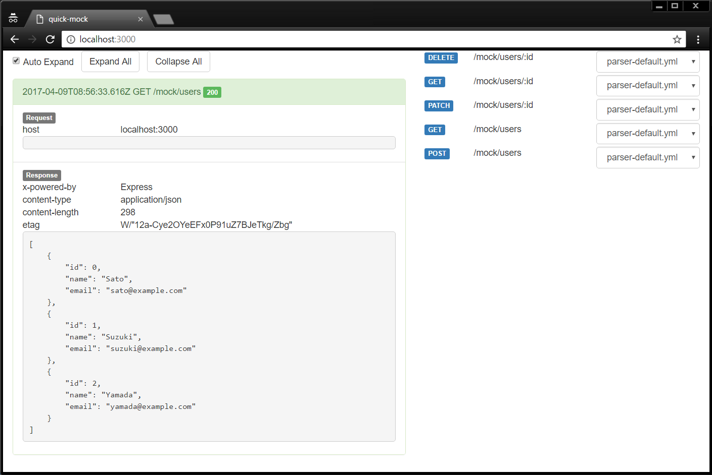

[](https://travis-ci.org/arenahito/instant-mock)
[](https://codecov.io/gh/arenahito/instant-mock)
[](https://badge.fury.io/js/instant-mock)

# instant-mock

instant-mock is a quick and easy web API mock server.


## Installing globally

Installation via npm:

```sh
npm install -g instant-mock
```


## Usage

```sh
mkdir mymock
cd mymock
instant-mock init
instant-mock
```

You can open [http://localhost:3000](http://localhost:3000) to view the instant-mock web console.

All mock API is mounted on [http://localhost:3000/mock](http://localhost:3000/mock).
Please try GET to [http://localhost:3000/mock/users](http://localhost:3000/mock/users) by curl or web browser. It is sample mock API created by `instant-mock init`.


## Configuration

Servce configuration is wrote on `server.yml`

```yml
http:
  host: localhost
  port: 3000

socket:
  host: localhost
  port: 3010
```


## Creating your mocks

### API definition

You can create mock definition file to `mock` directory.
Mock API URL is auto generated by directory path.
`mock/api-name/@METHOD` is mapped to `METHOD: http://localhost:3000/mock/api-name`
`METHOD` can use get/post/put/patch/delete.

If you need route parameters, can use `PARAM` directory.
`mock/api-name/$id/@get` is mapped to `GET: http://localhost:3000/mock/api-name/:id`


### Request parser

Request for mock is parsed by user definition parser file.
User definition parser file name start with "parser-" and format is yaml or js.

Try create a parser file below, and access to `http://localhost:3000/mock/books` after restart the instant-mock.

**/mock/books/@get/parser-default.yml:**

```yml
status: 200                   # Response status code.
headers:                      # Response headers.
  Content-Type: application/text
rawBody: 'test body'          # Response body.
```

### Define the response body to other file

You can define response body to a any file.

**./mock/books/@get/body.json:**

```json
{
  "key": "value"
}
```

**./mock/books/@get/parser-default.yml:**

```yml
status: 200
headers:
  Content-Type: application/json
body: 'body.json'    # Response body file.
```


### Change a reponse by request

Parser file can define multiple resonse for switing by request. Define request parsing rule to `if`, and response to `then`.

Try create a parser file below, and access to `http://localhost:3000/mock/books/:id` after restart the instant-mock.
If `:id` is "1" then response body is "user 1", and if it is "3" then response is 404.

**./mock/books/$id/@get/parser-default.yml:**

```yml
- if:
    params:
      id: 1
  then:
    rawBody: 'book 1'

- if:
    params:
      id: 2
  then:
    rawBody: 'book 2'

- then:
    status: 404
```

`if` is can use params/query/body, and it is "and" condition.

- **params:** Route parameter.
- **query:** Query string parameter.
- **body:** Parsed json body parameter.


### Advanced parser

YAML format parser is support simple rule only.
Use a js parser if you need more advanced rules.

**./mock/shelves/:id/@get/parser-default.js:**

```js
exports.default = function (req) {
  return {
    status: 200,
    headers: {
      'content-type': 'application/text',
    },
    rawBody: 'your book is ' + req.params.id,
  };
};
```

## Web console

You can open [http://localhost:3000](http://localhost:3000) to view the instant-mock web console.
Web console can change parser, and show mock api access logs.


